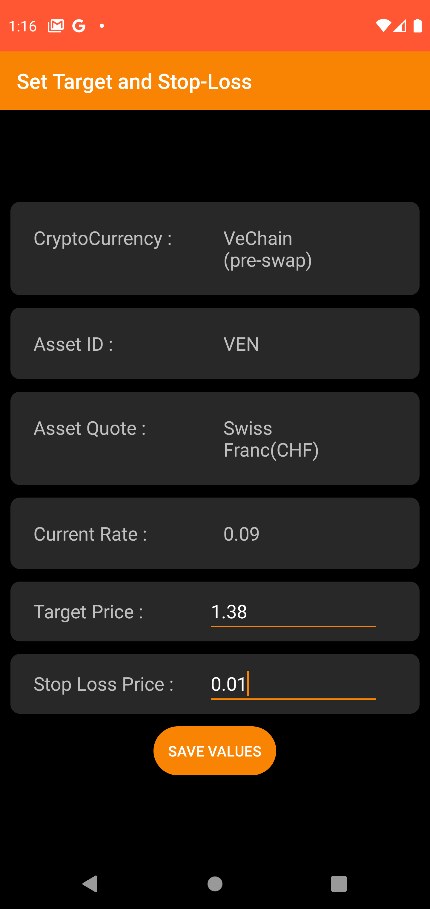

# CryptoBuddy 
> From a meme base Dogecoin seeing a gain of over 100% to the biggest crash crypto market has ever seen all caused by a billionaire’s tweet, the cryptocurrency trading market has seen it all. With CryptoBuddy, stay updated about the exchange rates of 10000+ cryptocurrencies at once and keep track of your own targets and step losses!

## Table of Contents
* [General Info](#general-information)
* [Technologies Used](#technologies-used)
* [Features](#features)
* [Usage](#usage)
<!-- * [License](#license) -->

## General Information
- With CryptoBuddy, keep track of the fluctuations of 10000+ cryptocurrencies at once.
- With the cryptocurrency market, being as inconsistent as it gets, CryptoBuddy helps one to keep track of their own choice of cryptocurrencies and keep records of specific targets and stop losses, in 5 different currenccies, namely US Dollar, Euro, Yen, Swiss Franc and Indian Rupee

## Technologies Used
- Java
- SQLite
- Firebase
- Android Studio

## Features

- Keep track of 10000+ cryptocurrencies at once
- Once can choose time periods of their choice to see the trends in exchange rates of a particular cryptocurrency
- Make a personalized list of “favourites” to keep track of specific cryptocurrencies
- Keep record of the targets and stop losses of the cryptocurrencies you have invested in

## Usage
>Firstly log-in/sign-up using your email id. Clicking "Forgot Password" and entering your email sends a link to your email through which password can be reset.

 

>Now the home page opens with your user name displayed:

>Go to Search, a list of available cryptocurries are shown. You can search in the list and the floating action button takes yoou back to the top of the list after scrolling down.

>Clicking on any of the cryptocurrencies, takes you to the activity containing the graph of exchange rates of the last 7 days(daily highest and daily lowest). One can click on the dates to open a date picker and select their own range of dates to see the trends in the cryptocurrency. Also one can select any one of US Dollar, Euro, Yen , Swiss Franc, and Indian Rupee. On the top right are the buttons to add to favourites and to set target and stop losses.

 
>Go to Favourites, one can see their chosen list of favourite crycptocurrenices. Clicking on any of them opens the activity with the graph. one can swipe to remove an intem from favourites.

>Lastly, go to Targets to see your set of targets and stop losses in the cryptocurrencies you have invested in. Here also one can delete by swiping and also theres an delete all option in the option menu(click three dots at top right)

